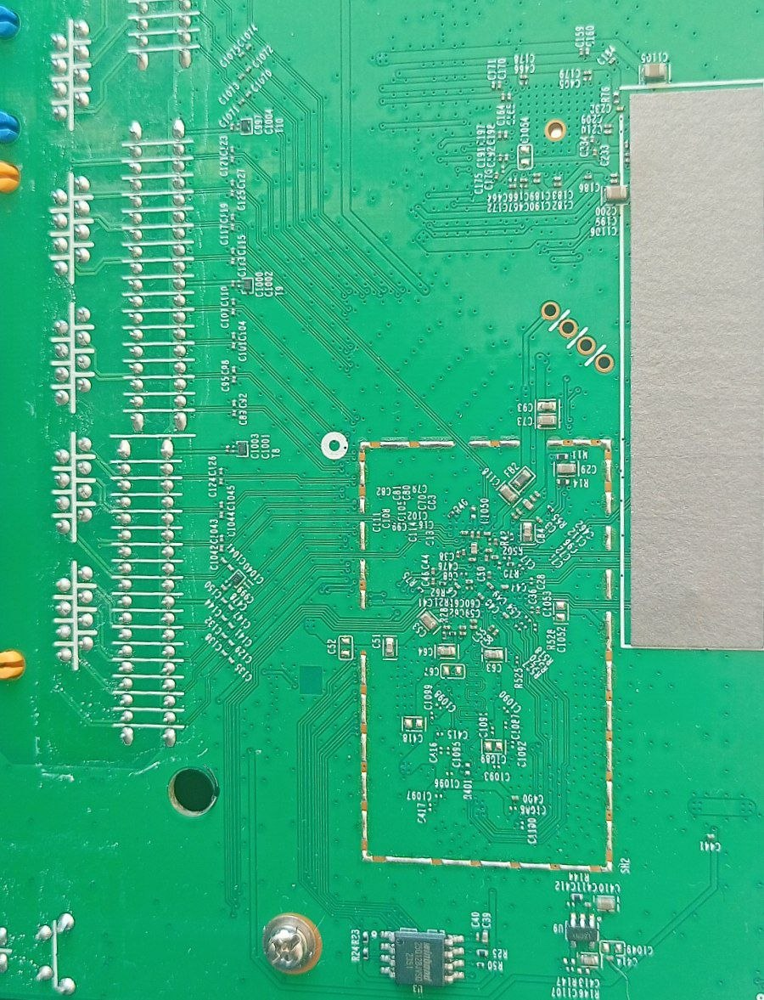
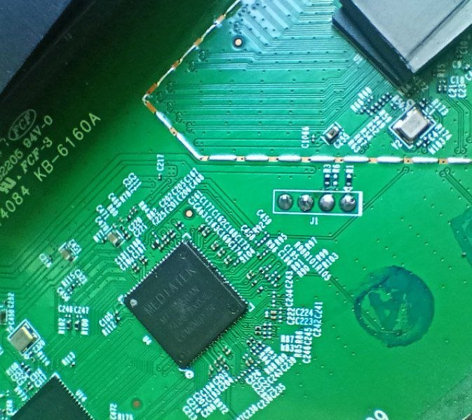
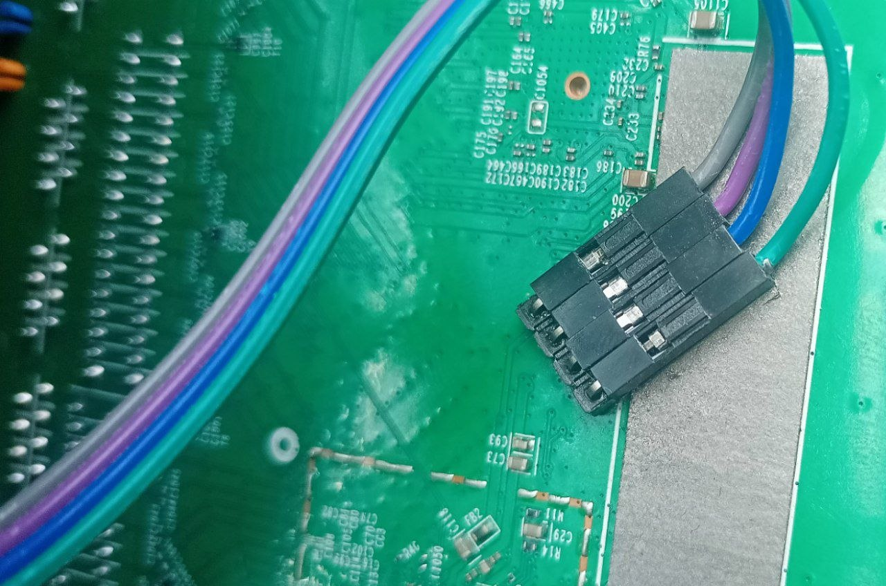
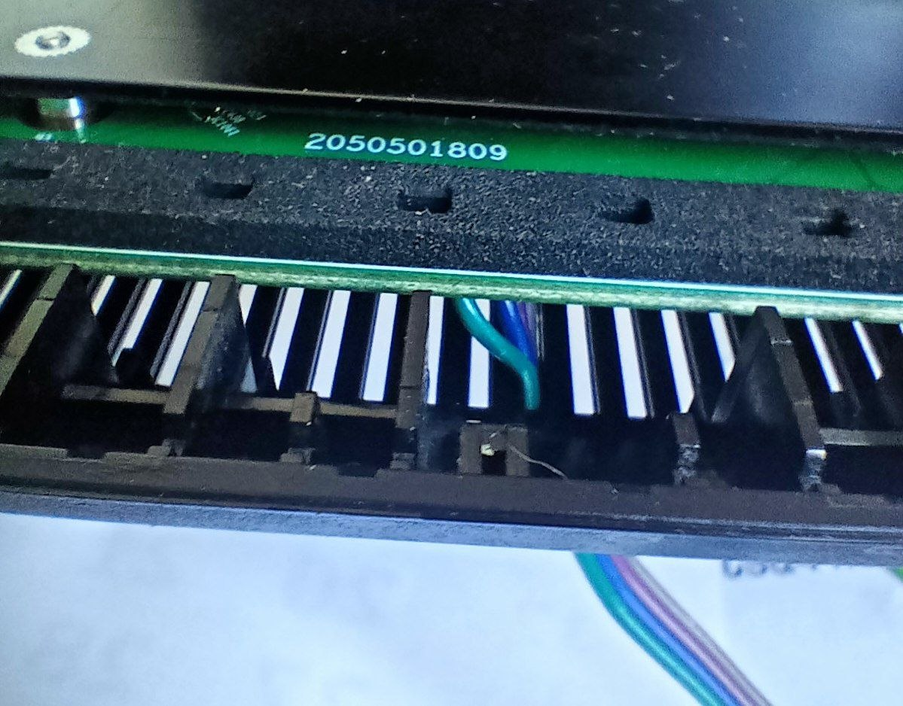
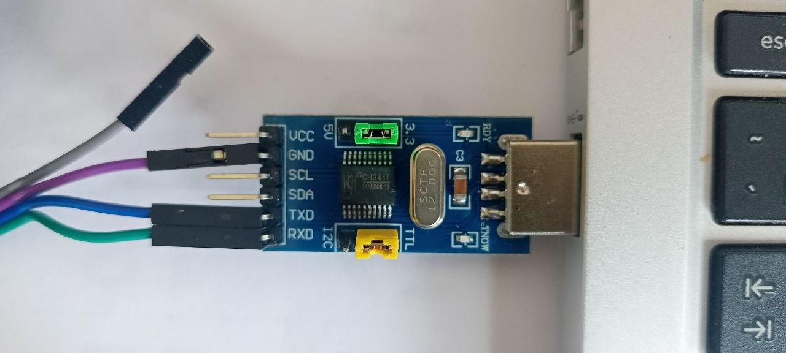
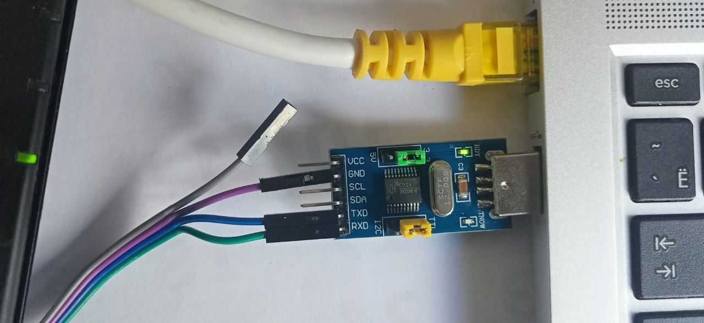

# UART + U-Boot → OpenWrt Flash Log
Date: 2026-05-17

## Hardware

- USB-UART adapter: CH341 → `/dev/ttyUSB0`
- Wiring: GND→GND, PC-RX→router-TX, PC-TX→router-RX, VCC not connected
- Ethernet: PC `enp3s0` → router LAN4 port

## Step 1 — Serial terminal

```bash
sudo usermod -aG dialout $USER
newgrp dialout
screen -L /dev/ttyUSB0 115200
```
Log saved to `screenlog.0`. (renamed EX220-factory.log)

## Step 2 — Interrupt U-Boot

Power on router, immediately press any key. Boot menu appears, tap ArrowDown:

```
*** U-Boot Boot Menu ***
  1. Startup system (Default)
  2. Upgrade firmware
  3. Upgrade bootloader
  4. Upgrade bootloader (advanced mode)
  5. Load image
  0. U-Boot console
```

Select `0` → U-Boot console prompt.

## Step 3 — TFTP server on PC

```bash
sudo ip addr add 192.168.1.2/24 dev enp3s0
sudo ip link set enp3s0 up
sudo apt install tftpd-hpa
# download and checksum initramfs
sudo cp bin/openwrt-ramips-mt7621-tplink_ex220-v1-initramfs-kernel.bin /srv/tftp/initramfs.bin
sudo systemctl restart tftpd-hpa
```
Image used: snapshot r34469-862a4edfa6 (25.12.2).

## Step 4 — Load initramfs via TFTP

In U-Boot console:

```
setenv ipaddr 192.168.1.1
setenv serverip 192.168.1.2
tftpboot 0x80010000 initramfs.bin
bootm 0x80010000
```

Transfer: 7,832,548 bytes at 14.9 MiB/s. OpenWrt Boot OK. `passwd` - root password set.


## Step 5 — SSH connection


```bash
ssh-copy-id root@192.168.1.1

ssh root@192.168.1.1 df -h
# Filesystem   Size    Used Available Use% Mounted on
# tmpfs       57.3M   13.4M     44.0M  23% /
# tmpfs       57.3M  232.0K     57.1M   0% /tmp
# tmpfs      512.0K       0    512.0K   0% /dev
```

## Step 6 — MTD partition layout
Show: `cat /proc/mtd`
```
dev:     size  erasesize  name
mtd0:   30000      10000  boot
mtd1:   10000        "    boot-env
mtd2:   10000        "    factory       ← MAC addresses + Wi-Fi cal data, never overwrite
mtd3:   10000        "    config
mtd4:   10000        "    isp_config
mtd5:   10000        "    rom_file
mtd6:   10000        "    cloud
mtd7:   20000        "    radio         ← RF calibration, never overwrite
mtd8:   10000        "    config_bak
mtd9:  f30000        "    firmware      ← entire stock firmware
mtd10: 3e0000        "    kernel
mtd11: b50000        "    rootfs
mtd12:  40000        "    rootfs_data
```

Flash chip confirmed: Winbond W25Q128BV, 16 MiB.

## Step 7 — Factory flash backup

Stream with `netcat` (don't use /tmp, fast):

**PC - [`scripts/receive_dumps.sh`](../scripts/receive_dumps.sh):** listen on port 9000, save to `dumps/`.  
**Router - [`/tmp/send.sh`](../scripts/send.sh):** stream each `/dev/mtdN` into `nc`.

All 13 partitions in `dumps/mtdN_<name>.bin`.

## Step 8 — Flash sysupgrade

```bash
# Download sysupgrade (snapshot matching booted initramfs)
SYSUPGRADE=openwrt-ramips-mt7621-tplink_ex220-v1-squashfs-sysupgrade.bin
URL=https://downloads.openwrt.org/snapshots/targets/ramips/mt7621/$SYSUPGRADE
wget $URL

# Transfer to router (no sftp-server in initramfs - use legacy SCP protocol)
scp -O $SYSUPGRADE root@192.168.1.1:/tmp/sysupgrade.bin

# Flash
sysupgrade -v /tmp/sysupgrade.bin
```

Router reboots into permanent OpenWrt at `192.168.1.1`.

## Notes

- Downgrade to known-good 23.05.4 is possible at any time with another `sysupgrade` call
- Restore stock firmware: flash `dumps/mtd9_firmware.bin` back to the firmware partition
- Factory/radio partitions must be preserved — they contain hardware-specific calibration


| A-> | B-> | C-> |
|-------------------------------------|-------------------------------------|-------------------------------------|
|         |  |   |
|  |  |  |
